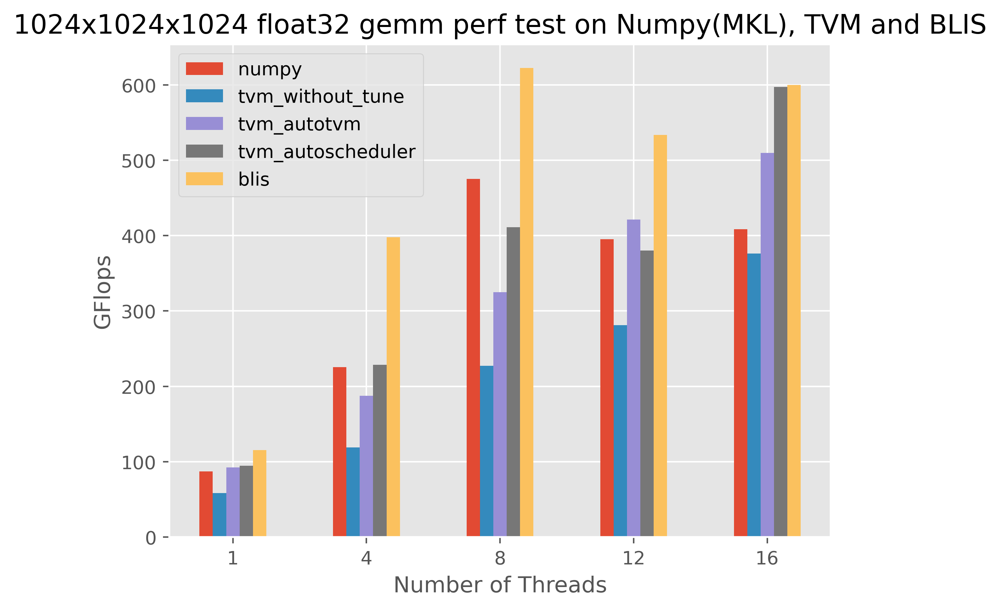
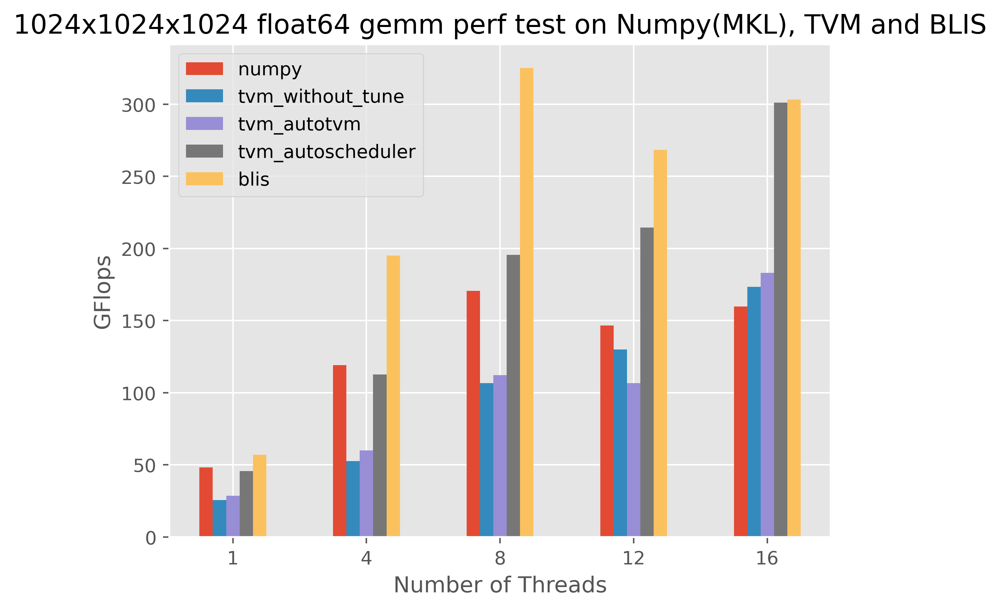

# TVM和BLIS在CPU上做GEMM计算的性能测试

本项目分别使用TVM和BLIS做32位和64位的1024x1024x1024的C += AB的矩阵运算，并在单线程、4线程、8线程和16线程的情况下做了性能测试。

## 测试结果  
----
TVM和BLIS单精度GEMM计算性能对比  
  

TVM和BLIS双精度GEMM计算性能对比  
  

## 测试机器  
--------------------
测试在一台机械革命笔记本上完成，机器配置参数如下：  
* CPU Model: AMD Ryzen 7 4800H with Radeon Graphics
* CPUs: 16
* 主频：Max 2900, Min 1400, CPU调频未关闭
* L1d cache:  256 KiB
* L2 cache:  4 MiB
* L3 cache:  8 MiB
* OS: Ubuntu 20.04.1 64位

*说明：*  
* *tvm_without_tune.py使用TVM的How to optimize GEMM on CPU例子计算方案并使用固定参数运行*  
* *tvm_autotvm.py使用TVM的autotvm对tvm_without_tune的计算方案参数调优*
* *tvm_autoscheduler.py使用TVM的auto_scheduler自动搜索计算方案和最优参数*
* *blis调用本地编译的blis库进行计算，编译时使用 --enable-cblas -t openmp CC=clang CXX=clang++选项*  
* *numpy使用后端MKL支持的conda中的numpy binary进行同样的矩阵运算*  

## 依赖
-------
项目依赖
- TVM https://github.com/apache/tvm
- BLIS https://github.com/flame/blis  
  BLIS编译时候使用如下选项：--enable-cblas -t openmp CC=clang CXX=clang++

## Quick Start
-------
* 参考https://tvm.apache.org/docs/install/index.html安装TVM
* 参考https://github.com/flame/blis/blob/master/docs/BuildSystem.md安装blis（使用--enable-cblas -t openmp编译选项）
* git clone https://github.com/billmuch/matmul_perf_test
* python tvm_autotvm_tune.py float32 tune  使用autotvm调优tvm 单精度 gemm计算代码
* python tvm_autotvm_tune.py float64 tune  使用autotvm调优tvm 双精度 gemm计算代码
* python tvm_autoscheduler_tune.py float32 tune  使用autoscheduler调优tvm 单精度 gemm计算代码
* python tvm_autoscheduler_tune.py float64 tune  使用autoscheduler调优tvm 双精度 gemm计算代码
* ./build.sh 编译blis.cpp
* python gemm_perf.py float32 测试TVM和BLIS的单精度GEMM性能
* python gemm_perf.py float64 测试TVM和BLIS的双精度GEMM性能

## TVM做GEMM运算代码的调优及运行
-------
- tvm_without_tune.py的运行  
  python tvm_without_tune.py float32  
  or  
  python tvm_without_tune.py float64

- tvm_autotvm_tune.py的调优   
  python tvm_autotvm_tune.py float32 tune  
  or  
  python tvm_autotvm_tune.py float64 tune  

- tvm_autotvm_tune.py的运行(必须调优后才能运行)  
  python tvm_autotvm_tune.py float32  
  or  
  python tvm_autotvm_tune.py float64  

- tvm_autoscheduler_tune.py的调优  
  python tvm_autoscheduler_tune.py float32 tune  
  or  
  python tvm_autoscheduler_tune.py float64 tune  

- tvm_autoscheduler_tune.py的运行(必须调优后才能运行)  
  python tvm_autoscheduler_tune.py float32  
  or  
  python tvm_autoscheduler_tune.py float64  

## BLIS做GEMM运算代码的编译及运行  
-------
- 编译  
  ./build.sh  

- 运行  
  ./blis_float32.x  
  or  
  ./blis_float64.x  

## 运行性能测试代码  
-------
- python gemm_perf.py float32  
or  
python gemm_perf.py float64  

